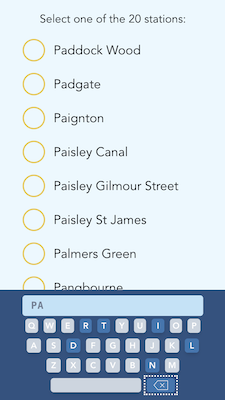

See application [here](https://train-ticket-machine.netlify.app)

## Table of Contents

* [About the project](#about-the-project)
    * [Built with](#built-with)
* [Getting started](#getting-started)
    * [Prerequisites](#prerequisites)
    * [Installation](#installation)
    * [Available commands](#available-commands)
    * [More information](#more-information)
* [Running application](#running-application)
* [Further changes](#further-changes)
* [Contact](#contact)

## About the project

This is a small user interface of a train ticket machine. These machine has a direct but unreliable connection to the
central system and use a touchscreen display which works as follows.
As the user types each character of the station's name on the touchscreen, the display should:
1. Update keyboard to show all valid choices for the next character.
2. List of possible matching stations.

### Built with

- [Typescript](https://www.typescriptlang.org/)
- [Vue 3](https://v3.vuejs.org/)
- [Vite](https://github.com/vitejs/vite) as a project bundler and webserver
- [Tailwind](https://tailwindcss.com/)
- [Jest](https://jestjs.io/) for unit tests
- [Cypress](https://www.cypress.io/) for e2e tests

## Getting started

### Prerequisites

To use this project there is `npm` or `yarn` packages managers needed.

### Installation

To install all dependencies just run `yarn` or `npm i` command.

### Available commands

- `dev` it runs dev server with HMR
- `build` it creates dev bundle
- `test:unit` it runs unit tests with jest
- `test:e2e` it runs e2e tests with cypress
- `test` it runs two above commands at once
- `lint:scripts` it runs eslint
- `lint:styles` it runs stylelint
- `lint` it runs two above commands at once
- `cypress:open` it opens cypress application
- `deploy` it runs script to deploy dev bundle to [Github Pages](https://train-ticket-machine.netlify.app)

### More information

Project has [husky](https://github.com/typicode/husky) attached to check every commit. It is running eslint, stylelint
and [commit lint](https://github.com/conventional-changelog/commitlint). Husky is also running unit tests on every push
command.

## Running application

1. Run application: `yarn dev` or `npm run dev`
2. Navigate to `localhost:3000`

## Further changes

- Add dependency injection library to improve service maintenance
- Make list component more common
- Change static texts in component to translatable texts
- Add virtual list for stations list to improve performance
- Add router
- Add state manager

## Contact

Pawel Galias - [linkedin](https://linkedin.com/in/pawgalias) - [pawel@galias.me](pawel@galias.me)

Project Link: [https://github.com/pawgalias/train-ticket-machine](https://github.com/pawgalias/train-ticket-machine)

Project Demo: [https://train-ticket-machine.netlify.app](https://train-ticket-machine.netlify.app)
